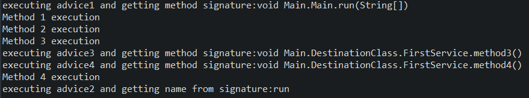
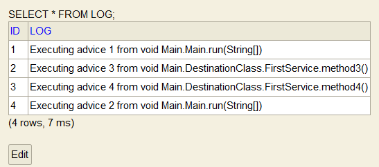

# SpringAOPExample
Example of AOP in Spring Boot

Main dependencies:

 	 <dependency>
	  	 <groupId>org.springframework</groupId>
	  	 <artifactId>spring-aspects</artifactId>
 	</dependency>
	
Creating the Service class:

	@Service
	public class FirstService {

		public void method1(int x) {
			
			System.out.println("Method 1 execution");
		}
		public void method2(String text) {
			
			System.out.println("Method 2 execution");
		}
		@OwnAnnotation// this is a custom annotation created on Main.MainDestination.OwnAnnotation
		public void method3() {
			
			System.out.println("Method 3 execution");
		}
		
		@TestAnnotation// this is a custom annotation created on Main.MainDestination.OwnAnnotation
		public void method4() {
			
			System.out.println("Method 4 execution");
		}

	}

      }
Creating the Aspect class( in this class are defined pointcuts and advices):

		@Component
		@Aspect
		public class Aspects {
			
			@Autowired
			LogRepository logRepository;
			

			@Pointcut("execution(* Main.*.* (..))")// creating pointcut for all methods in the package Main
			public void allMethodsInPackage() {
				
			}
			@Pointcut("@annotation(Main.DestinationClass.OwnAnnotation)")// creating pointcut for all methods annotated with @OwnAnnotation
			public void allMethodsWithAnnotation() {
				
			}

			@Before("allMethodsInPackage()")// creating advice to store a log before the pointcut "allMethodsInPackage()" is triggered
			public void advice1(JoinPoint jp) {
				
				Log newLog1 = new Log();
				
				newLog1.setLog("Executing advice 1 from " + jp.getSignature());
				
				logRepository.save(newLog1);
				
				System.out.println("executing advice1 and getting method signature:"+ jp.getSignature());
			}
			@After("allMethodsInPackage()")// creating advice to store a log after the pointcut "allMethodsInPackage()" is triggered
			public void advice2(JoinPoint jp) {
				
				Log newLog2 = new Log();
				
				newLog2.setLog("Executing advice 2 from " + jp.getSignature());
				
				logRepository.save(newLog2);
				
				System.out.println("executing advice2 and getting name from signature:" + jp.getSignature().getName());
			}
			@After("allMethodsWithAnnotation()")// creating advice to store a log before the pointcut "allMethodsWithAnnotation()" is triggered
			public void advice3(JoinPoint jp) {
				
				Log newLog = new Log();
				
				newLog.setLog("Executing advice 3 from " + jp.getSignature());
				
				logRepository.save(newLog);
				
				System.out.println("executing advice3 and getting method signature:" + jp.getSignature());
			}
			@Before("@annotation(Main.DestinationClass.TestAnnotation)")// creating advice to store a log before the pointcut "@annotation(Main.DestinationClass.TestAnnotation)"
			public void advice4(JoinPoint jp) {
				
				Log newLog3 = new Log();
				
				newLog3.setLog("Executing advice 4 from " + jp.getSignature());
				
				logRepository.save(newLog3);
				
				System.out.println("executing advice4 and getting method signature:"+ jp.getSignature());
			}

		}

      
 Creating Log model:
 
		@Entity
		public class Log {

			@Id
			@GeneratedValue(strategy=GenerationType.AUTO)
			private int id;
			
			private String log;
			
			//constructor getters and setters
			}

Final result on console:

Final result on InMemory DB h2:

